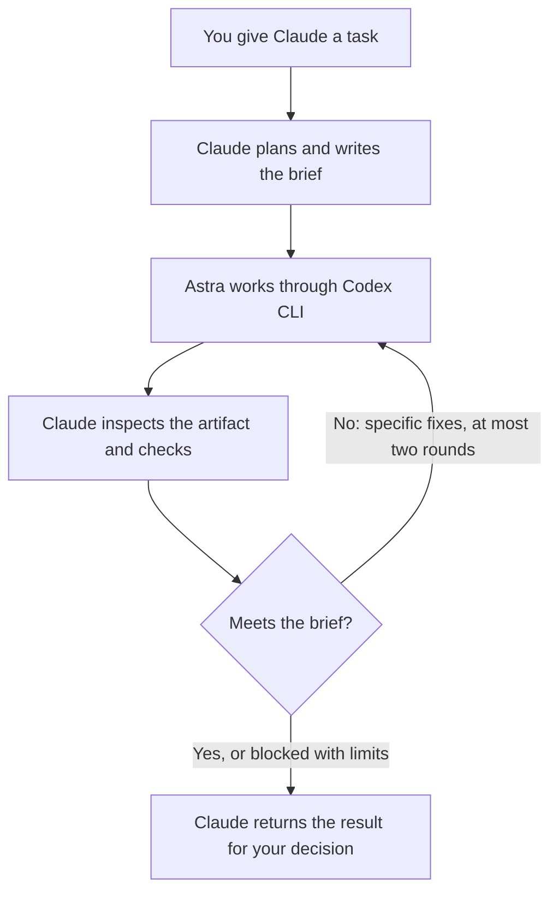

# Claude + Astra Router

**Keep Claude Code in charge. Send the execution to Astra. Bring the result back for review.**

A standalone setup guide for professionals who want Claude Code to plan and review work while GPT-6 Astra does the assigned work through the Codex CLI.

You describe the job to Claude. Claude writes a bounded brief, runs Astra, inspects what came back and sends specific fixes to the same worker session. You keep the final decision about using or sharing the result.

[Set it up](#set-it-up) · [Copy the Claude instructions](templates/CLAUDE.md) · [See the dispatch script](scripts/astra.py) · [Validation](guides/validation.md)



## What this actually routes

| Role | Runs in | Owns |
|---|---|---|
| **Claude: lead** | Claude Code | Brief, scope, planning, review and final explanation |
| **Astra: worker** | Codex CLI, `gpt-6-astra` | The assigned analysis, draft or implementation, plus evidence of checks |
| **You** | Your normal workflow | Whether to accept, send, publish or act on the work |

This is a Claude Code to Codex connection. It is not a comparison of chat apps, a Codex-only subagent setup, or an automatic best-model selector.

## Before you start

You need a local computer with **Claude Code, Codex CLI and Python 3** installed, both AI tools signed in, and access to `gpt-6-astra` through Codex. Both tools must be permitted to receive the project material. A Claude subscription does not provide Codex access, and a Codex login does not establish access to this specific model.

Use your existing approved subscriptions or API arrangements. There is no fixed paid-plan recommendation here. If either tool or Astra is unavailable, the setup stops and reports the problem.

Installation and authentication instructions: [Claude Code quickstart](https://code.claude.com/docs/en/quickstart), [Codex CLI](https://learn.chatgpt.com/docs/cli). The first-use checks below are also explained in [setup and troubleshooting](guides/setup.md).

## Set it up

### 1. Download this folder

Use **Code → Download ZIP** on this GitHub page and extract it into a new folder. Open that folder in Claude Code. Keep this first trial separate from your real work project.

If you downloaded a ZIP, the folder does not have Git history. Ask Claude to initialise a local Git repository in this new folder. This creates a local checkpoint; it does not upload anything. A Git clone already has that history.

### 2. Add the routing instructions

Copy [templates/CLAUDE.md](templates/CLAUDE.md) to a file named `CLAUDE.md` at the root of the downloaded folder. Start a new Claude Code session in that folder so the project instructions are loaded.

You can ask Claude to make that copy. If a `CLAUDE.md` already exists, merge the routing section with its current instructions rather than replacing the file. Keep [scripts/astra.py](scripts/astra.py) in the project's `scripts/` folder.

Project `CLAUDE.md` files supply Claude Code's working instructions; they are not permission controls. [Claude Code documentation](https://code.claude.com/docs/en/how-claude-code-works).

### 3. Check the two tools

Ask Claude:

```text
Check that Python 3, Claude Code and Codex CLI are installed and that
Codex is signed in. Read the project routing instructions. Do not print
credentials or inspect unrelated files. Tell me if the setup is missing
anything; do not install or change global settings automatically.
```

The first real worker call verifies whether the requested Astra model can run. A configuration file containing its name is not a successful test.

### 4. Give Claude a job to route

Start with the included fictional sources:

```text
Use the Claude + Astra routing instructions for this task.

Prepare a weekly update from examples/weekly-update/sources.md, accurate
as at the date specified there. The reader is the procurement steering
group. Keep it within 180 words, label important claims with their source
IDs and preserve the conditional start date and unresolved approvals.

You are the lead. Write the brief, then actually dispatch Astra using
scripts/astra.py in read-only mode. Do not draft the update yourself.
Tell Astra not to read the answer-key files.

Read Astra's result and check each important claim against the sources.
If it needs correction, send the exact findings back to the same recorded
Astra session. Return the update, what you checked and anything I still
need to decide. Do not send or publish it.
```

The downloaded folder also contains answer keys. Asking Astra not to read them is an instruction, not an access restriction, so this starter exercise is not a blind test. For a blind trial, use a separate Git folder containing only the runner and permitted source material.

Watch for an actual `scripts/astra.py run` tool call and the returned artifact paths. “I would ask Astra” is a plan, not a completed dispatch.

## What happens underneath

Claude writes the task into a brief file and runs:

```bash
python3 scripts/astra.py run --project . --brief work/update/brief.md --run-dir work/update/astra
```

The Python script calls `codex exec` with `--model gpt-6-astra`, passes the brief through standard input, records the exact session ID and saves the result. It defaults to a read-only worker sandbox. For an authorised file-editing task, Claude can explicitly select `--sandbox workspace-write`.

For a correction, Claude writes the findings into another file and runs:

```bash
python3 scripts/astra.py revise --run-dir work/update/astra --brief work/update/revision-1.md
```

The script targets that run's recorded session, not the most recently active Codex task. It permits two revision calls, records each attempt separately and reports failure rather than treating old output as a fresh result. Claude still has to assess the content.

The connection uses the installed Codex CLI directly. It does not require a Claude-to-Codex plugin, API server or global model-setting change. The commands follow [Codex's non-interactive interface](https://learn.chatgpt.com/docs/non-interactive-mode).

## What to look for before accepting a result

Claude should show the actual artifact and explain which checks passed. For a written update, inspect the sources and missing information. For a spreadsheet or code change, inspect the delivered file and appropriate tests; a summary of edits alone is insufficient.

A useful reviewer can also stop the work. [This real correction](guides/real-correction.md) shows an unsupported claim removed from my LinkedIn drafts and another draft left blocked for missing personal evidence. It illustrates the review standard; it is not proof that the whole Claude-to-Astra connection ran in that earlier task.

## Files and limits

| File | Purpose |
|---|---|
| [Claude instruction template](templates/CLAUDE.md) | Assigns planning and review to Claude; execution to Astra |
| [Dispatch script](scripts/astra.py) | Runs Astra and resumes the exact worker session for fixes |
| [Setup and troubleshooting](guides/setup.md) | Prerequisites, permissions, output files and failure recovery |
| [Fictional source pack](examples/weekly-update/sources.md) | A first task that requires no employer material |
| [Review prompt](prompts/02-review.md) | Optional checklist for Claude's factual review |
| [Validation](guides/validation.md) | What was actually tested and what remains uncertain |

Keep briefs, worker logs and real outputs in the ignored `work/` folder. Do not commit credentials or private work. The scripts preserve the selected sandbox and do not bypass approval or security controls. Instructions to limit file scope still need to be checked; they are not an enforced per-file allowlist.

The guide currently uses Astra explicitly. It does not silently send work to a cheaper model or claim a cost saving. Add other routing choices only after you have evidence that they suit your work.

## A broader OS is coming

I've been curating a broader AI operating system over the past year: the instructions, context and working practices behind how I use these tools. I'll share more soon.

This router is a standalone part you can try now.

## Credit and reuse

 This repository provides an original Claude instruction template, a dispatch script and worked supporting material. See [attribution](ATTRIBUTION.md). Original repository content is available under the [MIT licence](LICENSE).
