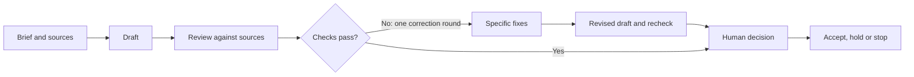

# AI Handover Guide

**Give AI a clear job, pass on the evidence, and check what comes back.**

A free, practical guide for professionals preparing updates, briefs and other work that someone needs to rely on. Start with one AI tool you are allowed to use. No coding, terminal commands or extra subscription is required by the exercise.

You will finish with a draft, a specific review and a corrected version you can inspect. You still decide whether it is fit to use.

[Start the exercise](#try-it-with-a-weekly-update) · [Copy the prompts](prompts/01-brief.md) · [Optional agent delegation](guides/delegation.md)

## Why I made this

An AI review of my LinkedIn drafts rejected an unsupported cost claim. The revised draft changed the sentence and kept the remaining approval decision visible. I could follow the criticism through to the correction.

This guide turns that handover into something you can try on a familiar piece of work. [Read the real before-and-after](guides/real-correction.md).

A review result is advice to the person deciding. It does not grant permission to send or publish.

## Try it with a weekly update

**You need:** an approved AI chat tool, the ability to paste text, and time to read the result. The practice material is entirely fictional. If file uploads or links do not work, paste the contents of each file. A link alone does not prove that an assistant has read it.

You can read and copy everything on GitHub. To keep a local copy, use **Code → Download ZIP**, then extract the folder. No Git commands are needed.

### 1. Give it a defined job

Open [the source pack](examples/weekly-update/sources.md). Copy the whole pack into your AI conversation along with the fenced prompt in [01: Brief](prompts/01-brief.md). Follow the prompt's bracket-filling instructions using the practice values in the source pack.

Keep the answer as your first draft. Do not supply the answer key yet.

### 2. Hand it over for review

Start a fresh conversation in the same approved tool, or another tool permitted to receive the same material. Paste the **original brief, complete source pack, first draft and [02: Review](prompts/02-review.md)**. The reviewer needs all four, even if the writer had access to them already.

Ask for the exact passage that fails a check, the supporting source and the required correction. A separate conversation provides a distinct review pass, not a guarantee of independent judgement.

If your first draft has no material defects, compare the review with the sources and move to step 4. To practise a correction deliberately, use the [intentionally flawed draft](examples/weekly-update/flawed-draft.md) as the draft in this step. It is a teaching example, not an observed AI failure.

### 3. Return specific fixes

Give the original writer the review and [03: Revise](prompts/03-revise.md). Retain the original brief and sources; paste them again if they are not available in that conversation. Ask for one correction round and a record of what changed.

Send the revised draft back to the reviewer with the same brief, sources and review prompt. If a material problem remains after that correction round, hold the output for a person to resolve. Do not keep cycling until the assistants agree.

### 4. Inspect the result yourself

Use the source pack to answer:

- Does the update distinguish completed work from planned work?
- Is the conflict between records visible?
- Are target dates kept separate from approved commitments?
- Can you trace each important claim to the source named beside it?
- Does it say what a person still needs to decide?

Then compare with the [expected review](examples/weekly-update/expected-review.md) and [illustrative corrected update](examples/weekly-update/corrected-update.md). Wording may differ. The evidence and remaining uncertainties should agree.

Keep your trial outputs privately. The optional `work/` folder is excluded from this repository's Git tracking, but that does not determine your AI provider's data handling or permissions.

## What to copy for your own work

| File | Use it to |
|---|---|
| [01: Brief](prompts/01-brief.md) | Define the reader, decision, sources and finish line |
| [02: Review](prompts/02-review.md) | Check important claims and request precise fixes |
| [03: Revise](prompts/03-revise.md) | Correct the output without filling gaps with guesses |
| [Optional delegation](guides/delegation.md) | Give a lead assistant bounded work to assign and review |

For real work, use only material your organisation allows in the selected tool. Keep originals intact. Check access before handing a task to a different environment. Change the acceptance checks to fit the decision: an internal meeting brief and a financial recommendation need different levels of assurance.

## When the work should change hands

| Problem | Next step |
|---|---|
| The source is missing or contradictory | Supply the permitted evidence or leave the issue unresolved |
| The assistant cannot access the source | Resolve access or use an approved environment that can |
| The requested output is unclear | Improve the brief before another attempt |
| The evidence and brief are adequate, but reasoning fails | Consider another model while keeping the same checks |

An additional model has to earn the time spent handing over and checking. Use the simple path while it does the job. [My optional routing approach](guides/delegation.md) explains where I use a lead and specialist assistants.

## What has been checked

The real editorial correction is documented separately from the fictional exercise. The practice answer key was checked against its source pack. [Validation notes](guides/validation.md) record the checks and their limits. This is a guide and prompt collection, not an installed integration or an automatic router. It does not claim measured savings or that a particular model is best.

## A broader OS is coming

I've been curating a broader AI operating system over the past year: the instructions, context and working practices behind how I use these tools. I'll share more soon.

This guide stands on its own. You can use it without waiting for that release.

## Credit and reuse

Inspired by [The Actionable AI's Route Astra guide](https://theactionableai.com/guides/route-astra-guide/read). This repository contributes original prompts, a professional practice exercise and a documented correction. It does not reproduce the source guide's routing block or commands. See [attribution](ATTRIBUTION.md).

By [Jacob / Jiplet](https://github.com/Jiplet). Original repository content is available under the [MIT licence](LICENSE).
